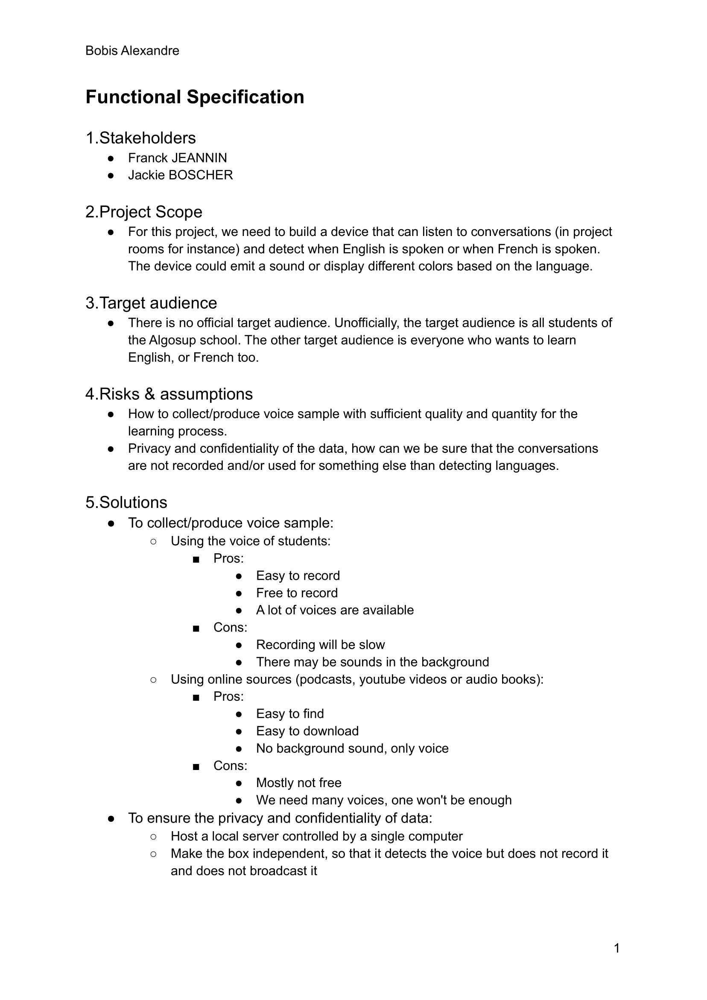
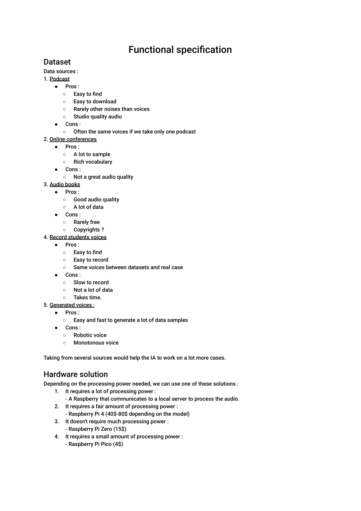
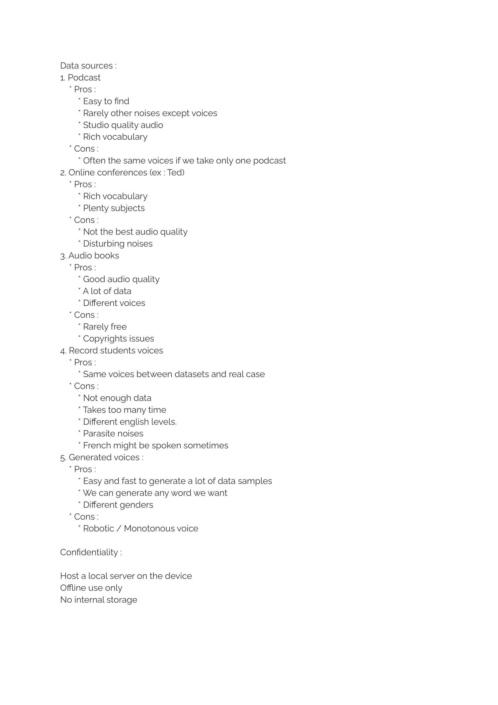
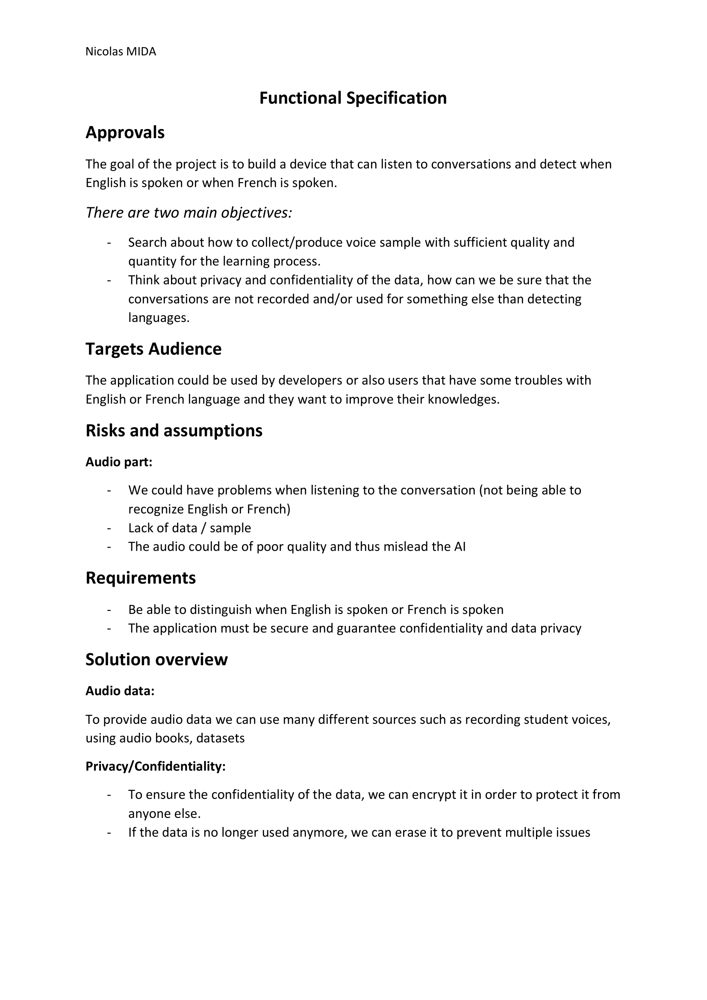
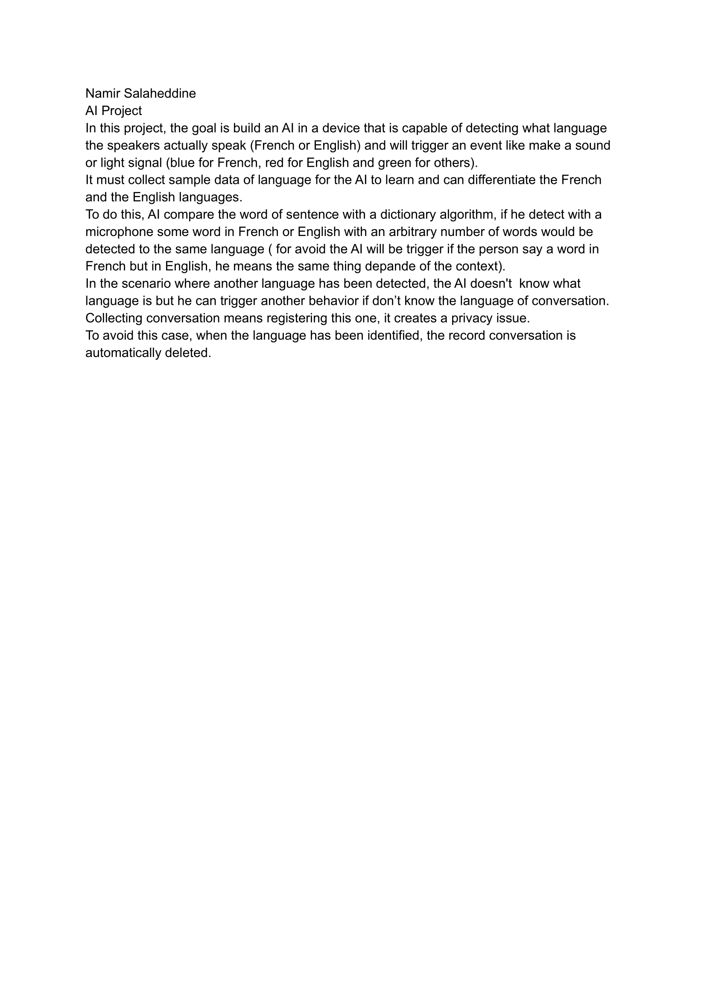
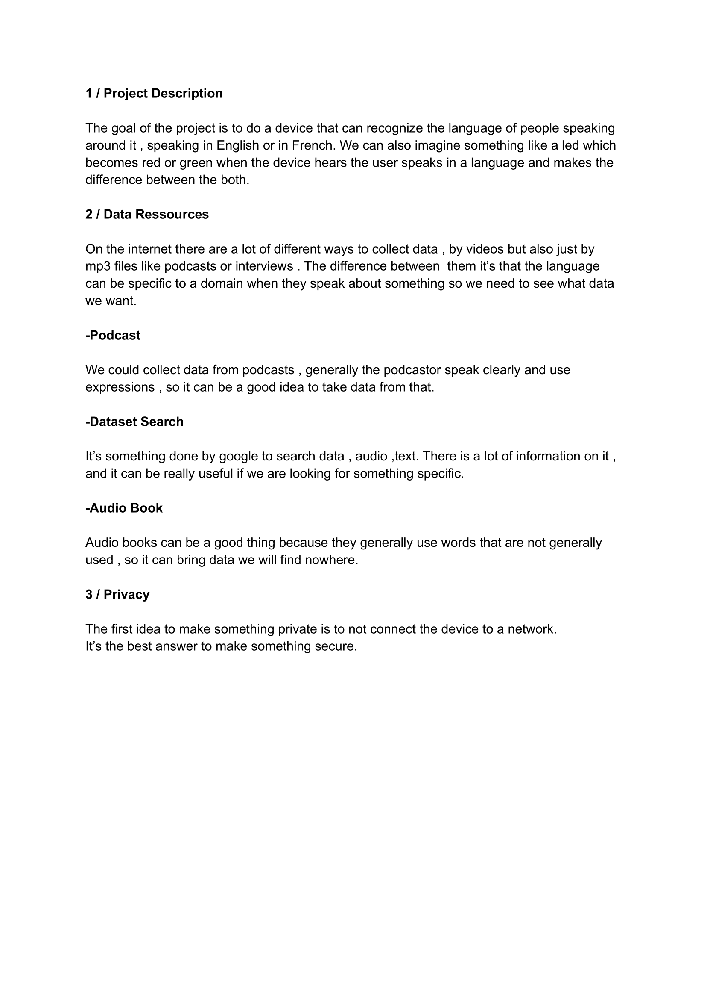

# Functional Specifications

Table of contents

- [Functional Specifications](#functional-specifications)
  - [Overview](#overview)
    - [Stakeholders](#stakeholders)
    - [Targets Audience](#targets-audience)
    - [Project Scope](#project-scope)
    - [Risks and assumptions](#risks-and-assumptions)
    - [Requirements](#requirements)
    - [Configuration](#configuration)
    - [Non Functional Requirements](#non-functional-requirements)
    - [Privacy & Security](#privacy--security)
    - [Our Functional Specifications](#our-functional-specifications)
      - [Bobis Alexandre](#bobis-alexandre)
      - [Caton Clément](#caton-clément)
      - [Leroy Victor](#leroy-victor)
      - [Mida Nicolas](#mida-nicolas)
      - [Namir Salaheddine](#namir-salaheddine)
      - [Trouvé Théo](#trouvé-théo)
    - [Terminology](#terminology)

## Overview

### Stakeholders

- JEANNIN Franck
- BOSCHER Jackie
- Users

### Targets Audience

There is no official target audience. Unofficially, the target audience is all students of the Algosup school. The other target audience is everyone who wants to learn English, or French too.

### Project Scope

The goal of the project is to build a device that can listen to conversations (in project rooms for instance) and detect when English is spoken or when French is spoken. The device could emit a sound or display different colors based on the language.

### Risks and assumptions

- We can expect poor voice recognition from the device.
- How to collect/produce voice sample with sufficient quality and quantity for the learning process.
- Privacy and confidentiality of the data, how can we be sure that the conversations are not recorded and/or used for something else than detecting languages.

### Requirements

- Speaking in english or in french

### Configuration

- You need a nanocomputer[^1] like 'Raspberry PI' or 'Arduino'

### Non Functional Requirements

- Other languages should be detected.
- Calculate the percentage of languages spoken

### Privacy & Security

Regarding the privacy, only one data sample will be stored in order to analyze it, and will be instantly deleted when we get the next sample, and the last sample will be erased when the device will be booted. The device might be connected to Internet, in order to have a remote interface.

### Our Functional Specifications

#### Bobis Alexandre

#### Caton Clément

  

  

#### Leroy Victor

  

  

#### Mida Nicolas

  

  

#### Namir Salaheddine

  

  

#### Trouvé Théo

  

  

### Terminology
[^1]: The term nanocomputer is increasingly used to refer to general computing devices of size comparable to a credit card.